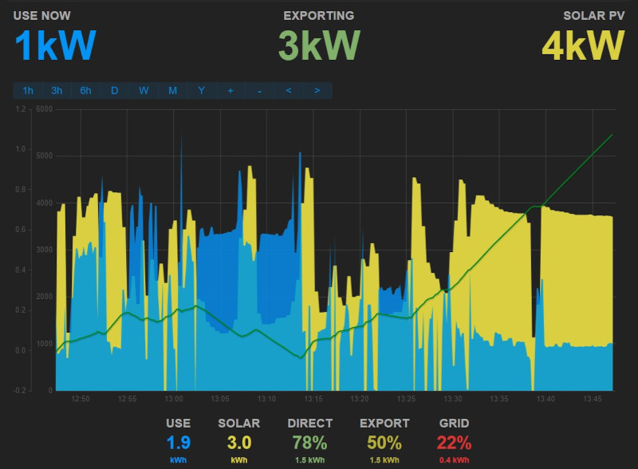
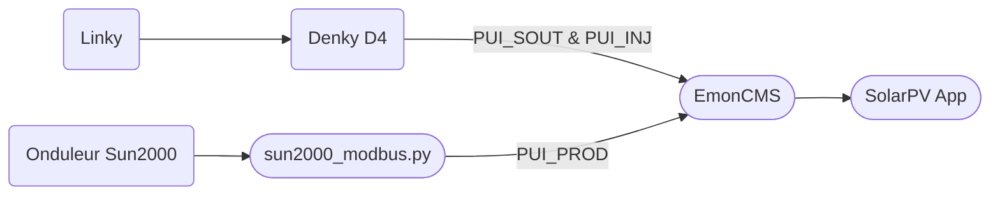

# Monitoring d'energie panneaux photovoltaïques et Linky

L'objectif est de surveiller une installation photovolatïque en auto-consommation individuelle. Nous avons donc 3 données à surveiller et à mettre en forme pour avoir un graphique de ce type :
- Puissance soutirée du réseau
- Puissance injectée dans le réseau
- Puissance produite par les panneaux

Ce repo est autant un partage qu'un aide mémoire.



## Système mis en place
La récolte de données se fait via un [Denky D4](https://github.com/hallard/Denky-D4) basé sur un ESP32, proposé par Charles Hallard. Il récolte les puissances importées et exportées sur le Linky. Il est secondé par [EmonCMS](https://github.com/emoncms/emoncms) qui se charge d'aggréger et présenter les données. L'onduleur livre, lui, ses données via un script Python sur mesure.


## EmonCMS
Installé sur un serveur local [Ubuntu Server](https://ubuntu.com/download/server) 22.04 LTS. L'installation depuis une clef "Live-usb" se fait facilement. Voir [là](https://doc.ubuntu-fr.org/live_usb) et [là](https://doc.ubuntu-fr.org/tutoriel/installation_sur_disque_usb).  
Le [tutoriel](https://github.com/openenergymonitor/EmonScripts/blob/master/docs/install.md) openEnergyMonitor est à suivre à la lettre pour EmonCMS. Il permet d'arriver au bout de l'installation sans éccueil. J'ai ajouté ensuite Python3 et pyModbus.

Dès que les données arrivent, elles sont disponibles dans "Inputs" et il s'agit d'en faire des "Feeds". Ce sont les feeds qui alimentent les dashboards. C'est parfaitement expliqué sur la doc de [SolarPV](https://docs.openenergymonitor.org/applications/solar-pv.html#configure-feeds).

## Denky D4
Matériel plutôt simple, il arrive prêt à fonctionner. Une [mise à jour](https://github.com/hallard/Denky-D4#firmware) plus tard, il est opérationnel. Le [tutoriel](https://github.com/hallard/Denky-D4#tasmota-template) proposé permet d'activer le template Tasmota adéquat et d'ajouter le Berry Script qui transfère les données, dont nous avons besoin, vers EmonCMS. Mon [script](./src/denky.be) est proposé pour illustration. Il envoie toutes les 15 secondes les données lues sur le Linky.

Selon le mode de communication du Linky, il faudra activer le mode standard (9600 bauds) ou le mode historique (1200 bauds). Voir la [doc](https://tasmota.github.io/docs/Teleinfo/#configuring-teleinfo).   
En mode standard, la commande est `energyconfig standard`, en mode historique, la commande est `energyconfig historique`.  
La liste des étiquettes TIC fournie, pour mémoire, [Standard](./tic_standard.md) et [Historique](tic_historique.md). Il est à remarquer que pour de l'autoconsommation, le mode standard est nécessaire.

__Remarque__ : l'interface proposée par le Denky n'est pas conçue pour un mode en autoconsommation. Les données remontées peuvent être _bizarres_ en apparence. Il remonte néanmoins correctement les données lues du Linky vers EmonCMS. Rien de grave, c'est juste à garder en tête.

.

## L'onduleur Huawei
L'onduleur Sun2000 de Huawei propose une interface ModbusTCP. Il faut l'activer depuis l'application FusionSolar pour qu'elle soit accessible par tous. La liste des registres vient de [Oliver Gregorius](https://github.com/olivergregorius/sun2000_modbus) bien que je n'ai pas pu faire fonctionner sa classe Python. J'ai donc ré-écrit un [script Python](./src/sun2000_modbus.py) simplifié pour ce que je voulais faire. Il envoie vers EmonCMS la puissance active et la température interne.  
La [doc Huawei](./res/Huawei-Modbus) et [ModbusTool](https://github.com/ClassicDIY/ModbusTool) a bien servi pour vérifier la lecture correcte des données via le script Python.

Un simple `crontab` permet de le lancer toutes les 15 secondes.
````console
* * * * * /usr/bin/python3 /home/emoncms/sun2000_modbus.py &
* * * * * sleep 15 && /usr/bin/python3 /home/emoncms/sun2000_modbus.py &
* * * * * sleep 30 && /usr/bin/python3 /home/emoncms/sun2000_modbus.py &
* * * * * sleep 45 && /usr/bin/python3 /home/emoncms/sun2000_modbus.py &
````
---

## Micro-onduleur Enphase
Ce n'est pas mon installation, mais cela peut aider. Pour lire de manière directe les données de la passerelle Enphase, le travail de [Frédéric Metrich](https://github.com/FredM67/EnvoyS2Emoncms) est assez intéressant. Une autre variante est d'utiliser le travail de [Markus Fritze](https://github.com/sarnau/EnphaseEnergy).

## Micro-onduleur APSystems
Pour ceux qui veulent se passer du Cloud APSYStems, c'est [par là](https://github.com/PlanetSmasher/APSystems-ECU-proxy-for-cloudless-operation), ou s'inspirer [apsystems-qs1-scraper](https://github.com/pdlubisz/apsystems-qs1-scraper)
