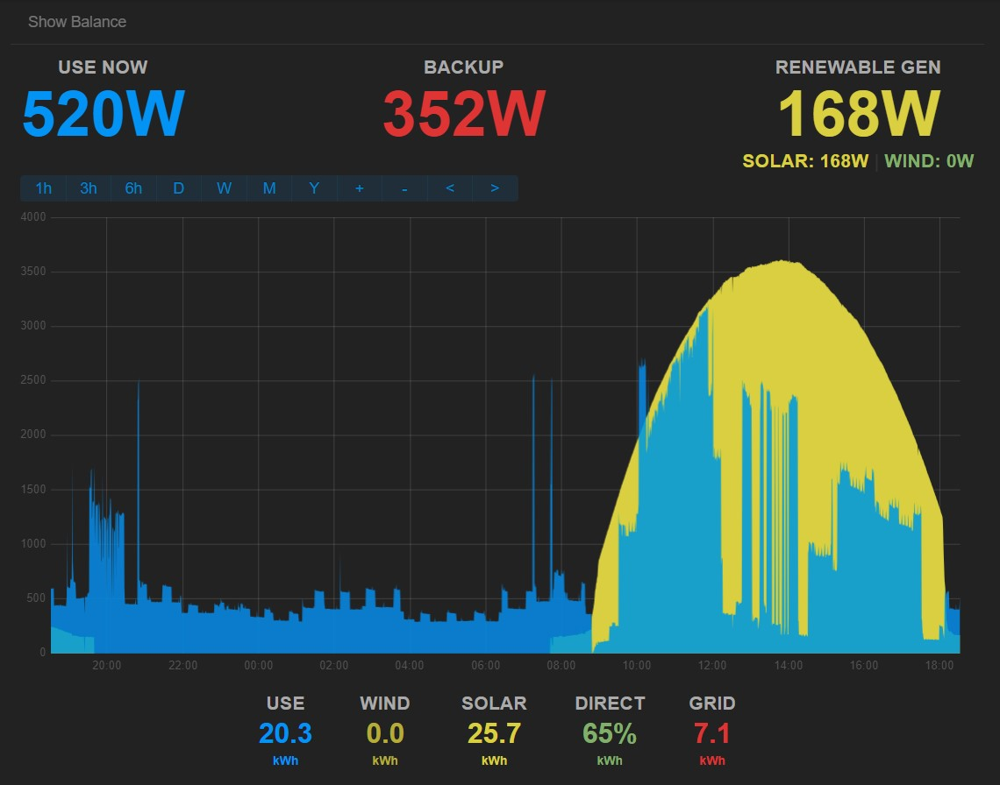
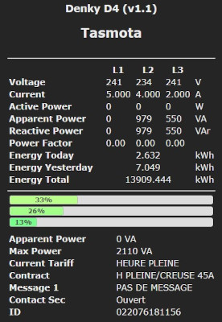

# Monitoring d'energie du Linky et de panneaux photovoltaïques

> [!NOTE]
> Due to the French national energy meter, _Linky_, all of this is very French related. This is why this depot is not in English. However, except the Berry script for Tasmota firmware which connects Linky, all the other things can be easily re-used.
> The Python's inline comments are in English for better understanding of the inverter connection.
  
  
  
L'objectif est de surveiller une installation photovolatïque en auto-consommation individuelle. Nous avons donc 3 données à surveiller et à mettre en forme pour avoir un graphique de ce type :
- Puissance soutirée du réseau
- Puissance injectée dans le réseau
- Puissance produite par les panneaux

Ce repo est autant un partage qu'un aide mémoire.

## Système mis en place
Nous avons deux appareils à surveiller de manière complémentaire : le compteur Enedis Linky et l'onduleur Huawei Sun2000. Le premier deviendra bavard via un [Denky D4](https://github.com/hallard/Denky-D4) proposé par Charles Hallard. Il permet de lire les données de la téléinfo et de les transmettre au serveur. L'onduleur est déjà connecté. Un script Python lira ses données pour les partager.
La collecte des données est faite par [EmonCMS](https://github.com/emoncms/emoncms) et/ou [PVOutput.org](https://pvoutput.org). Le diagramme ci-dessous permet de visualiser l'installation.

## Serveur installé
Nous recyclons un vieux PC sur lequel sera installé [Ubuntu Server](https://ubuntu.com/download/server) 22.04 LTS. L'installation depuis une clef "Live-usb" se fait facilement. Voir [là](https://doc.ubuntu-fr.org/live_usb) et [là](https://doc.ubuntu-fr.org/tutoriel/installation_sur_disque_usb).  

## EmonCMS
Le [tutoriel](https://github.com/openenergymonitor/EmonScripts/blob/master/docs/install.md) openEnergyMonitor est à suivre à la lettre pour EmonCMS. Il permet d'arriver au bout de l'installation sans éccueil.
Dès que les données arrivent, elles sont disponibles dans "Inputs" et il s'agit d'en faire des "Feeds". Ce sont les feeds qui alimentent les dashboards. C'est parfaitement expliqué sur la doc de [SolarPV](https://docs.openenergymonitor.org/applications/solar-pv.html#configure-feeds).

## Denky D4
Matériel plutôt simple, il arrive prêt à fonctionner. Une [mise à jour](https://github.com/hallard/Denky-D4#firmware) plus tard, il est opérationnel. Le [tutoriel](https://github.com/hallard/Denky-D4#tasmota-template) proposé permet d'activer le template Tasmota adéquat et d'ajouter le Berry Script qui transfère les données, dont nous avons besoin, vers EmonCMS. Mon [script](./src/denky) est proposé pour illustration. Il envoie toutes les 15 secondes les données lues sur le Linky.

Selon le mode de communication du Linky, il faudra activer le mode standard (9600 bauds) ou le mode historique (1200 bauds). Voir la [doc](https://tasmota.github.io/docs/Teleinfo/#configuring-teleinfo).   
En mode standard, la commande est `energyconfig standard`, en mode historique, la commande est `energyconfig historique`. La liste des [étiquettes TIC](./doc/tic_standard_histo.md) fournie pour mémoire. Il est à remarquer que pour de l'autoconsommation, le mode standard est nécessaire.

__Remarque__ : l'interface proposée par le Denky n'est pas conçue pour un mode en autoconsommation. Les données remontées peuvent être _bizarres_ en apparence. Il remonte néanmoins correctement les données lues du Linky vers EmonCMS. Rien de grave, c'est juste à garder en tête. **UPDATE**: modifier l'interface est possible. C'est [expliqué là](https://github.com/hallard/Denky-D4#custom-web-interface). Il y a aussi l'alternative de [Nicolas Bernaerts](https://github.com/NicolasBernaerts/tasmota/tree/master/teleinfo) qui semble for intéressante.

.

## L'onduleur Huawei
L'onduleur Sun2000 de Huawei propose une interface ModbusTCP. Il faut l'activer depuis l'application FusionSolar pour qu'elle soit accessible par tous. 
Le [script](./src/sun2000_modbus) proposé connecte l'onduleur et récupère les données pour les envoyer sur EmonCMS et/ou PVOutput. Le fichier de configuration permet de l'adapter à votre installation.  
L'installation est décrite via le fichier de [documentation](./src/sun2000_modbus/readme.md)

Pour ceux qui souhaitent aller plus loin, la [doc Huawei](./doc/Huawei-Modbus) et [ModbusTool](https://github.com/ClassicDIY/ModbusTool) a bien servi pour vérifier la lecture correcte des données via le script Python.

---
Pour les autres types d'installation sur micro-onduleur, et ceux qui me l'ont demandé. Quelques liens proposés [micro-onduleurs.md](./doc/micro-onduleurs.md)
