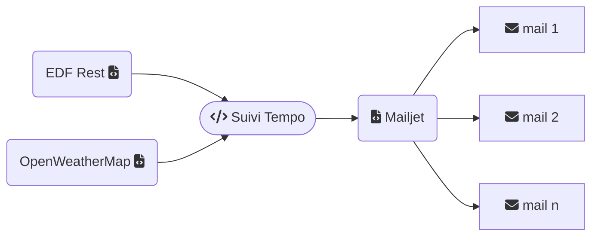

# Suivi tempo
Script python qui vérifie les données de couleur Tempo via les API Rest d'EDF et envoie un mail d'alerte si nécessaire. Le mail est enrichi des prévisions météo locale des prochaines 24h.

## Fonctionnement



Si une variation de jour ou de couleur de jour est détectée, le script poursuit avec l'envoi d'un mail, si le niveau d'alerte souhaité est atteint. Par exemple, pour n'avoir que les alertes impliquant un jour rouge. Si le mail doit être envoyé, le script récupère les données, les met en forme et transmet à Mailjet pour envoi.  
Pour l'automatisation, vous pouvez soit le faire à intervalle régulier (couleur de demain au plus tôt) ou à horaire fixe.

Pourquoi Mailjet ? Parce qu'avec OVH en SMTP, l'envoi de mail depuis un script ne garanti pas l'expédition ou la réception. Ensuite cela permet de découvrir une API via un compte gratuit.

## Installation
Nécessite Python 3 et `Requests` `mailjet_rest`  
````sh
pip install mailjet_rest requests
````

Copiez les fichiers dans un dossier du serveur. Par exemple `home\emoncms\tempo`.  

Les fichiers minimum pour fonctionner sont
````
ene.py => vérifie les données de couleur du jour et de demain
mailmj.py => met en forme et envoie le mail
owm.py => gère la météo
utils.py => fonctions utilitaires
mail.tpl => modèle du mail HTML
mailtxt.tpl => modèle du mail format texte
meteo.tpl => modèle des cartouches météo
bulkmail.json => modèle d'envoi en masse vers Mailjet (contient la liste d'adresses)
config.json => configuration de l'envoi, paramétrage OWM et mailjet
icons-img.json => les icones météo disponibles en PNG base64
run.json => mémoire de la dernière exécution
tempo.sh => Script bash simple pour la mise en cron
````
Modifiez la configuration `config.json` et la liste des destinataires dans `bulkmail.json`.
Rendez les fichiers python exécutables `chmod a+x *.py`

Lancez une fois à la main `py ./ene.py` pour valider le fonctionnement.  
Si tout fonctionne, il restera à automatiser le lancement via un CronJob. Pour cela personnalisez le fichier tempo.sh par rapport à votre installation. Rendez le exécutable `chmod A+x tempo.sh`.  
Il n'y a plus qu'à l'appeler via le cron. Pour ma part, il est appelé à 6h puis toutes les heures entre 16 et 21h. `0 6,16-21 * * *`
