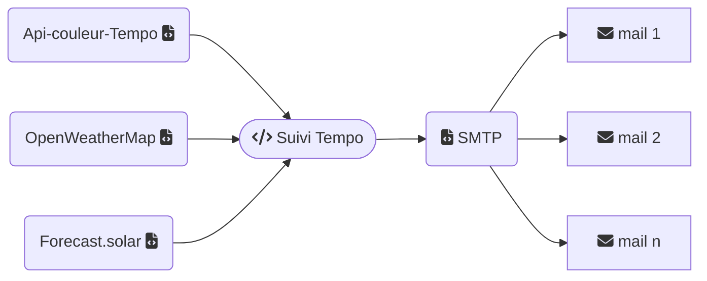

# Suivi tempo
Script python qui vérifie les données de couleur Tempo via les [api_couleur-tempo](https://www.api-couleur-tempo.fr) et envoie un mail d'alerte si nécessaire. Le mail est enrichi des prévisions météo locale des prochaines 24h et les prévisions de production solaires.

## Fonctionnement



Si une variation de jour ou de couleur de jour est détectée, le script poursuit, pour chaque groupe de destainataires, vérifie le niveau d'alerte souhaité avant de récupérer les informations de météo locale et de prévisions solaire (si besoin).
Pour l'automatisation, vous pouvez soit le faire à intervalle régulier (couleur de demain au plus tôt) ou à horaire fixe.

Depuis la première version, les changements suivants ont été apportés
- Passage à l'API Couleur Tempo qui est bien plus simple à intégrer que celle de RTE
- Retour à un SMTP
- Support de plusieurs lieux, avec pour chaque lieux plusieurs destinataires possibles
- Chaque lieu a ou non une installation photovolataïque

## Installation

Copiez les fichiers dans un dossier du serveur. Par exemple `home\emoncms\tempo`.  

Les fichiers minimum pour fonctionner sont
````
- libs
    |- __init__.py
    |- forecastsolar.py
    |- owm.py
    |- tempo.py
    |- smtp.py
    |- utils.py
- json
    |- config - sample.json
    |- icons-img.json
    |- samples
        |- extrait des réponses APIs
- tpl
    |- Les fichiers des modèles du mail, par blocs
ene.py
run.json
readme.md
tempo.sh
````

les fichiers importants sont 
- ene.py => vérifie les données de couleur du jour et de demain
- json/config-sample.json


Modifiez la configuration `config.json` pour le paramétrage. Il vous faut une appId pour OWM, la configuration de votre SMTP et le paramétrage de la liste des lieux / destinataires.  
Rendez les fichiers python exécutables `chmod a+x *.py`

Lancez une fois à la main `py ./ene.py` pour valider le fonctionnement.  
Si tout fonctionne, il restera à automatiser le lancement via un CronJob. Pour cela personnalisez le fichier tempo.sh par rapport à votre installation. Rendez le exécutable `chmod a+x tempo.sh`.  
Il n'y a plus qu'à l'appeler via le cron. Pour ma part, il est appelé à 6h puis toutes les heures entre 11 et 21h. `0 6,11-21 * * *`
